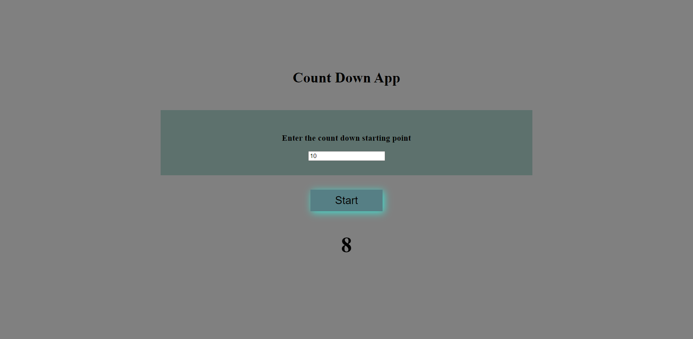

# Description
This is a simple project made as a count down timer. User has to enter the starting point and timer begins counting till it reaches 0

## Time Taken

2 hours approximately

## Things Learned

- ClearInterval
- SetInterval

[Live Demo](https://countdowntimer-akj.netlify.app/)

### SnapShot of the program

